# 星选商城

> 基于 Spring Cloud Alibaba 的分布式微服务电商平台，双前端（Vue 2 购物端 + React 管理端），集成 AI 智能客服 Agent 与 MCP Server。

    

## 功能亮点

- **微服务架构**：7 个业务服务 + API 网关，服务注册/配置中心基于 Nacos，服务间调用统一走 OpenFeign
- **统一鉴权**：JWT 登录态，网关层统一校验并注入用户身份，登录/登出全链路可控
- **高并发秒杀**：Redis Lua 预扣库存 + RabbitMQ 异步下单 + 本地消息表 + 幂等消费，配套死信队列实现订单超时自动取消与库存回滚
- **商品搜索**：Elasticsearch 全文检索（ik 中文分词、字段权重、关键词高亮），**未安装 ES 时自动降级 MySQL 模糊搜索**，开箱可用
- **AI 智能客服**：Spring AI 对接 DeepSeek，购物端/管理端双 Agent（SSE 流式对话），可对话式完成搜索、加购、下单、售后申请；支持多轮会话记忆与轻量用户画像
- **MCP Server**：内置 Model Context Protocol 服务端，外部 AI 客户端（如 Claude Desktop）可直接接入商城工具集
- **完整交易闭环**：购物车、收藏、模拟收银台、支付状态机、超时取消、仅退款售后
- **管理后台**：React + Ant Design Pro，商品/秒杀/轮播/订单/用户/售后管理，GMV 统计报表，管理端 AI Agent

## 效果演示

### 购物端（Vue 2，端口 7080）

| 首页 | 商品列表 | 商品详情 | 购物车 |
|:---:|:---:|:---:|:---:|
| 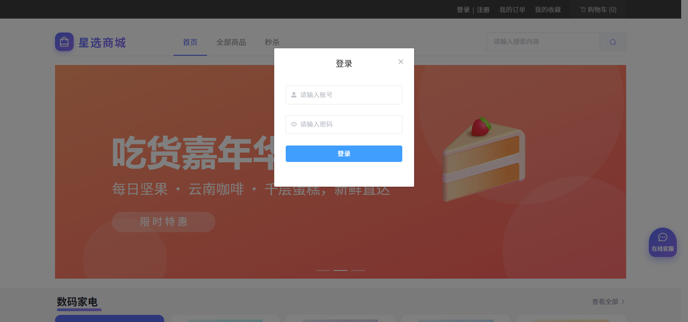 | 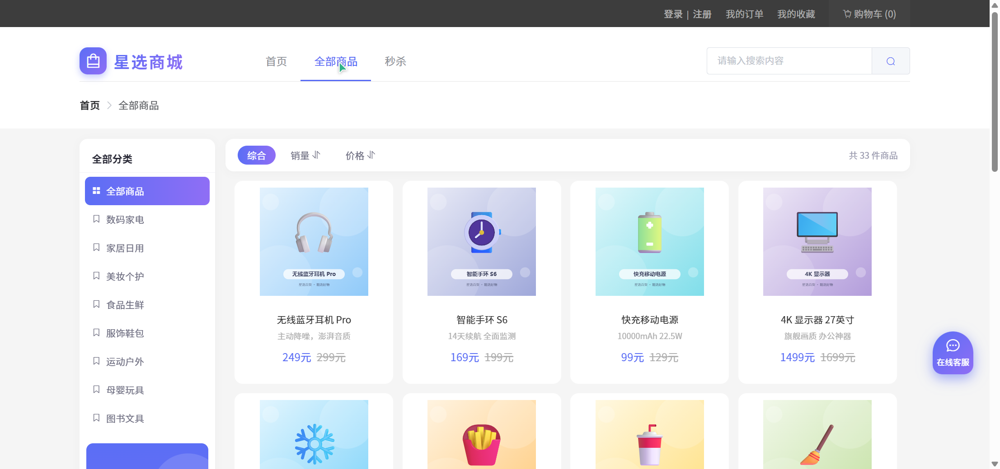 | 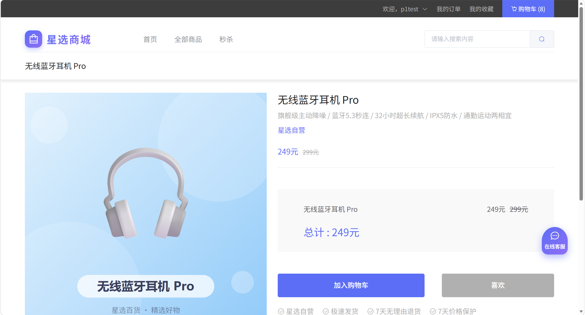 | 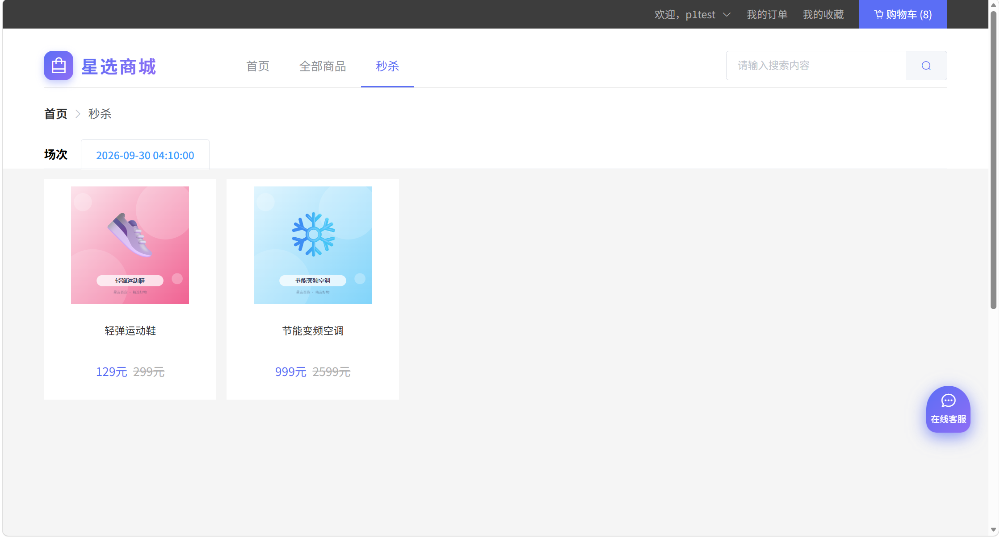 |

| 订单列表 | 秒杀会场 | 收银台 | 支付成功 |
|:---:|:---:|:---:|:---:|
| 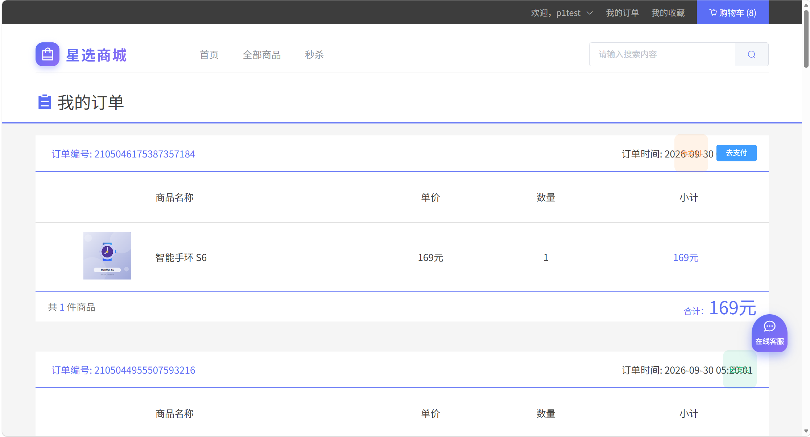 | 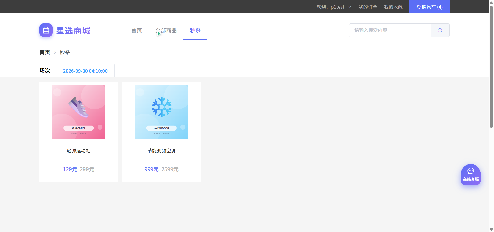 | 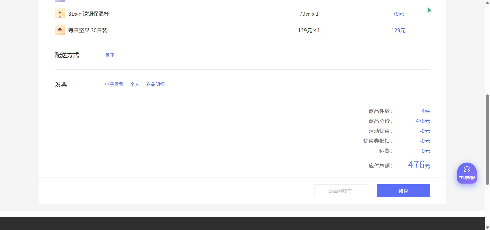 | 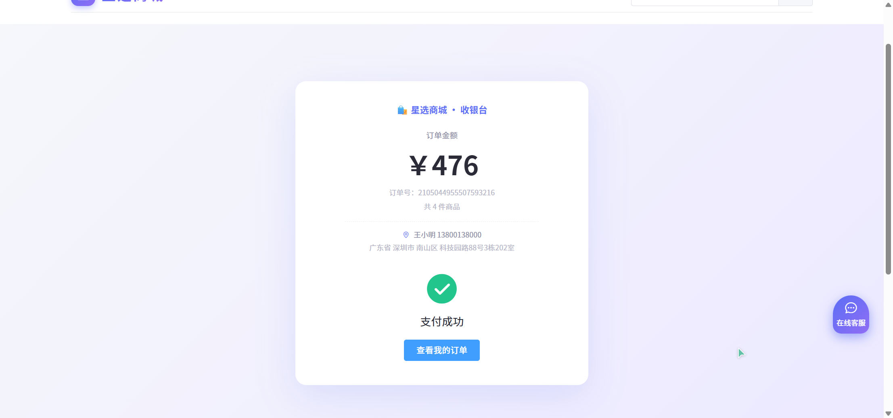 |

| ES 搜索 | AI 客服 | 售后申请 | 站内消息 |
|:---:|:---:|:---:|:---:|
| 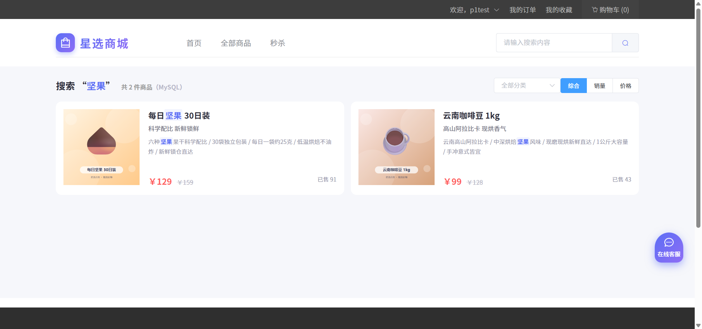 | 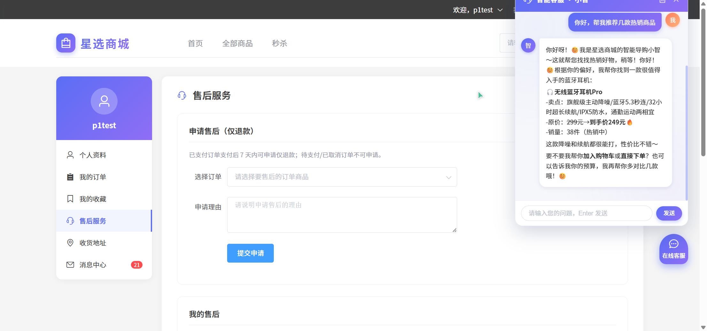 | 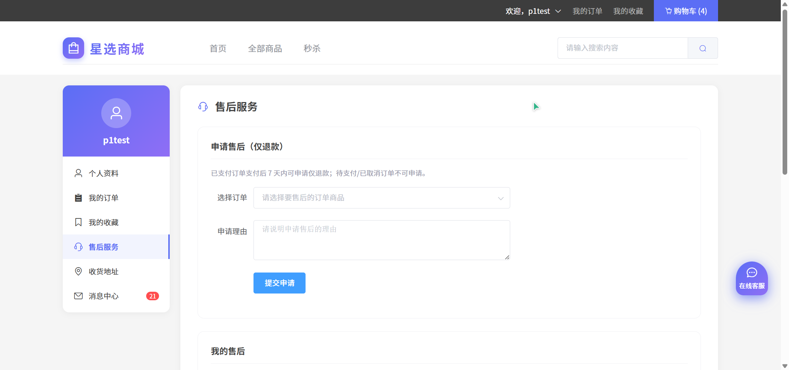 | 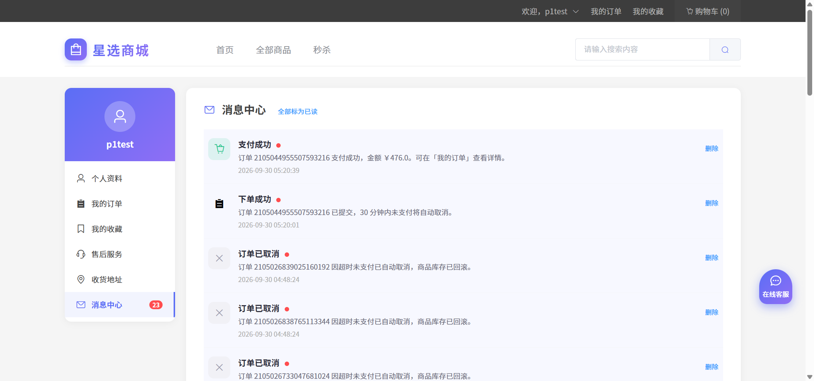 |

### 管理端（React + Ant Design Pro，端口 7090）

| 登录 | 数据看板 | 商品管理 | 秒杀管理 |
|:---:|:---:|:---:|:---:|
|  | 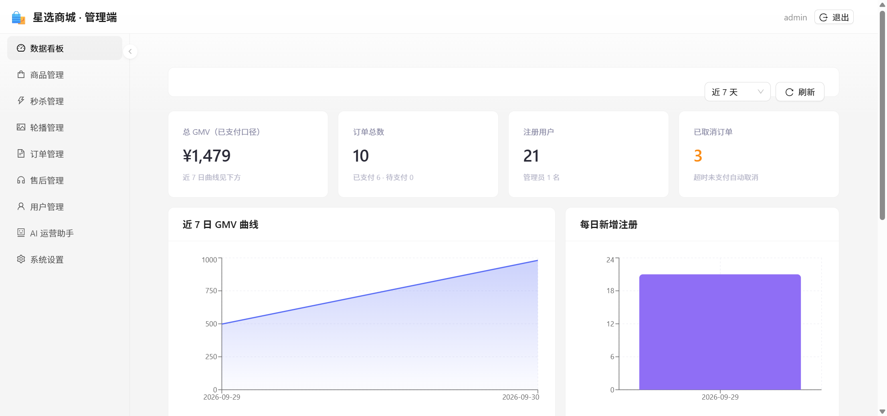 | 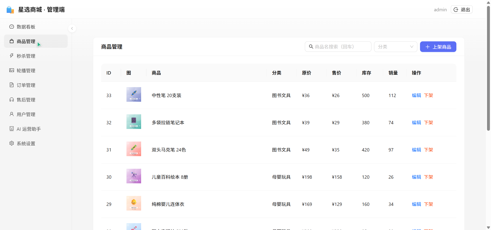 | 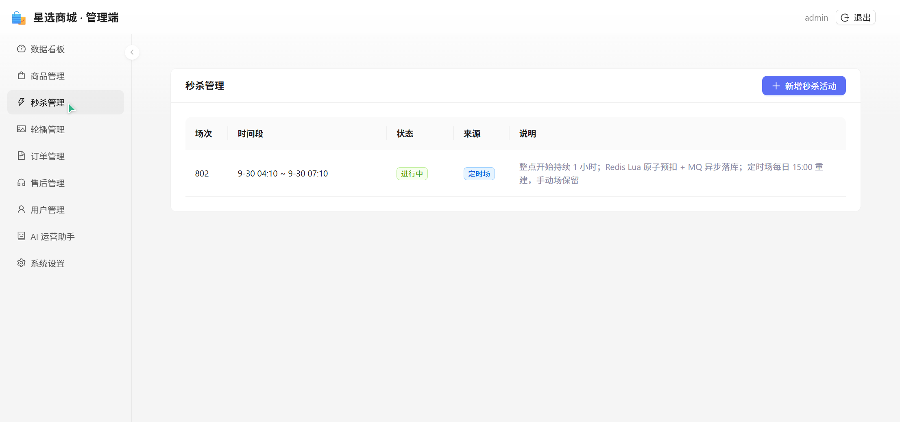 |

| 订单管理 | 用户管理 | 售后审批 | AI 助手 |
|:---:|:---:|:---:|:---:|
| 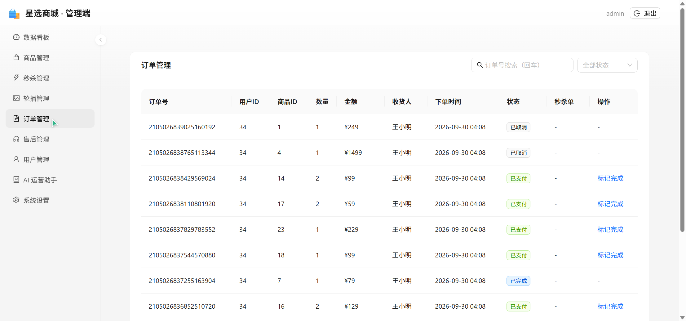 | 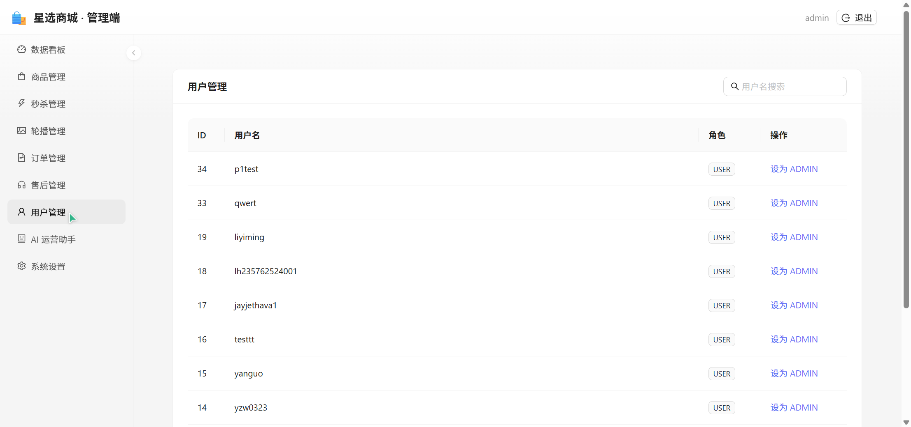 | 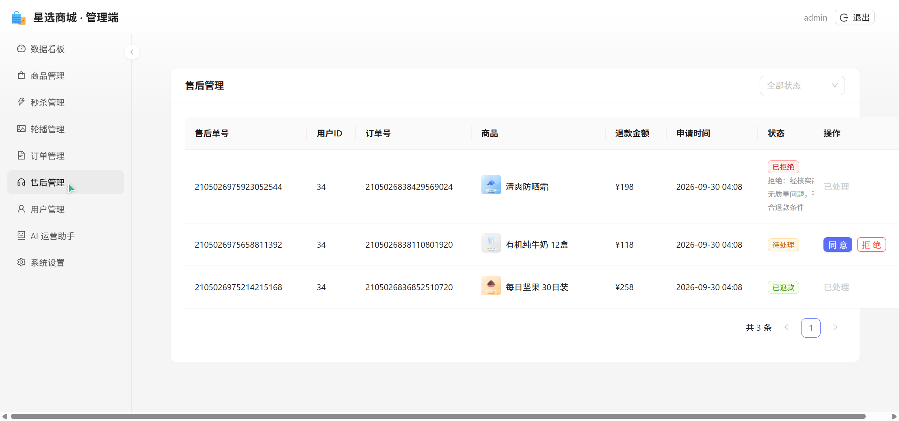 | 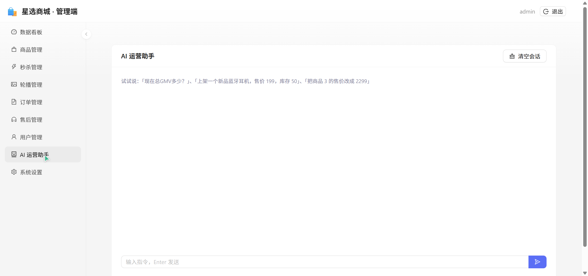 |

> 完整截图见 `demo-materials/` 目录（user 15 张 + admin 13 张）。

## 技术栈

| 分类 | 选型 |
|---|---|
| 语言与运行时 | JDK 17、Maven、Node.js 18+ |
| 微服务框架 | Spring Boot 3.4.6、Spring Cloud 2024.0.1、Spring Cloud Alibaba 2023.0.3.4 |
| 网关 | Spring Cloud Gateway（统一路由 + JWT 鉴权过滤器 + CORS） |
| 注册与配置中心 | Nacos 2.x（bootstrap 模式 + SHOP 配置组 + 公共配置下发） |
| 服务间调用 | Spring Cloud OpenFeign + LoadBalancer（统一 `Result<T>` 解包与错误传播） |
| 持久层 | MyBatis-Plus 3.5.10、MySQL 8.0+（单库多服务，按表归属读写） |
| 缓存 | Redis（会话黑名单、购物缓存、秒杀库存、会话记忆、用户画像） |
| 消息队列 | RabbitMQ（秒杀异步下单、订单超时死信、商品变更 ES 同步） |
| 搜索 | Elasticsearch 8.x + analysis-ik 插件（可选，未装/连接失败自动降级 MySQL） |
| AI | Spring AI 1.0.0 + DeepSeek（SSE 流式对话、Function Calling 工具、MCP Server） |
| 安全 | JJWT 0.12.6（HS256）、BCrypt 密码、网关统一鉴权 + 服务端 internal 接口二次校验 |
| 购物端前端 | Vue 2.6 + Vue Router + Vuex + Element UI + axios + marked/DOMPurify |
| 管理端前端 | React 18 + Vite + Ant Design 5 + Pro Components + ECharts + react-markdown |

## 系统架构

```
                          ┌─────────────────┐
   购物端 (Vue2 :7080) ──▶│   API 网关 :8080  │◀── 管理端 (React :7090)
                          │  路由 / JWT 鉴权  │
                          └───────┬─────────┘
            ┌──────────┬─────────┼──────────┬──────────┐
            ▼          ▼         ▼          ▼          ▼
        用户服务     商品服务   购物车服务   订单服务   管理服务    AI 服务(直连:8106)
        shop-user   shop-product shop-cart shop-order shop-admin shop-chat
         :8101        :8102       :8103      :8104      :8105        :8106
            │            │           │          │          │            │
            └──── Nacos 注册/配置 ────┴── OpenFeign 内部调用 ─────────┘
                                │
             MySQL(shop 单库)  Redis  RabbitMQ  Elasticsearch(可选)
```

| 服务 | 端口 | 职责 |
|---|---|---|
| shop-gateway | 8080 | API 网关：路由转发、JWT 统一鉴权、CORS；鉴权后注入 `X-User-*` 身份 header |
| shop-user | 8101 | 注册/登录/JWT 签发（BCrypt）/用户与地址管理 |
| shop-product | 8102 | 商品/分类/轮播/秒杀抢购/ES 搜索（可降级 MySQL） |
| shop-cart | 8103 | 购物车/收藏 |
| shop-order | 8104 | 订单/秒杀 MQ 消费/模拟支付/超时取消回滚/售后 |
| shop-admin | 8105 | 管理聚合接口、统计报表（经 Feign 聚合各服务数据） |
| shop-chat | 8106 | 购物/管理双 AI Agent（SSE）+ MCP Server（`/sse` 直连，不经网关） |

网关路由约定：`/user/**`→user；`/product|/category|/productPicture|/resources/**` 与 `/seckill/**`→product；`/cart|/collect/**`→cart；`/order|/pay/**`→order；`/admin/**`→admin（需 ADMIN 角色）；`/chat|/agent/**`→chat。

## 目录结构

```
shopping/
├── pom.xml                 # 父 POM：聚合 + dependencyManagement 版本锁定
├── shop-common/            # 公共模块：统一返回/异常/JWT 工具/用户上下文/Redis 序列化/Feign 身份透传
├── shop-feign-api/         # 服务间调用：@FeignClient 接口 + 跨服务 DTO
├── shop-gateway/  :8080    # API 网关
├── shop-user/     :8101    # 用户服务
├── shop-product/  :8102   # 商品服务
├── shop-cart/     :8103    # 购物车服务
├── shop-order/    :8104    # 订单服务
├── shop-admin/    :8105    # 管理服务
├── shop-chat/     :8106    # AI 服务（Agent + MCP Server）
├── shop-frontend/          # 购物端前端（Vue 2，dev 7080）
├── shop-admin-web/         # 管理端前端（React + AntD，dev 7090）
├── svc.sh / svc.bat        # 服务启停脚本（Linux/macOS 与 Windows，含前端启动）
├── nacos-config-upload.sh  # Nacos 公共配置上传脚本
├── sql/shop.sql            # 全量初始化脚本（15 张表 + 种子数据）
├── deploy/                 # 部署指南、Nacos 公共配置源、docker-compose、Nginx 配置示例
└── demo-materials/         # 项目效果图
```

## 环境要求

| 组件 | 版本要求 | 说明 |
|---|---|---|
| JDK | 17 | 后端构建与运行 |
| Maven | 3.6+ | 后端构建 |
| Node.js | 18+ | 前端构建与运行 |
| MySQL | 8.0+ | 业务库，单库 `shop` |
| Redis | 6.2+ | 缓存/秒杀/黑名单/会话记忆 |
| RabbitMQ | 3.13+ | 无需延迟插件（原生 TTL + 死信实现超时取消） |
| Nacos | 2.x（standalone） | 注册中心 + 配置中心 |
| Elasticsearch | 8.x + analysis-ik | **可选**：未安装自动降级 MySQL 搜索，不影响启动 |

## 快速开始

以下步骤在本机（localhost）从零跑通整个项目。

### 1. 初始化数据库

```bash
# 脚本自带建库语句，可重复执行（重复执行会重建全部表）
mysql -u root -p --default-character-set=utf8mb4 < sql/shop.sql
```

### 2. 准备 Nacos 并上传公共配置

```bash
# 方式 A：本地用 docker 快速启动一个开发用 Nacos
cd deploy && docker compose -f docker-compose.dev.yml up -d && cd ..

# 方式 B：使用已有的 Nacos（要求 2.x standalone）

# 上传公共配置（group=SHOP，幂等可重复执行）
NACOS_ADDR=localhost:8848 bash nacos-config-upload.sh
```

> 若 Nacos 内的公共配置缺失，服务会**拒绝启动**（fail-fast）——这是有意设计，避免配置静默丢失。

### 3. 构建后端

```bash
mvn clean package -DskipTests
```

> 各服务的 MySQL/Redis/RabbitMQ 连接信息支持环境变量注入（见下方环境变量表），默认值均指向 localhost；如需个性化覆盖，可在对应服务 `src/main/resources/` 下创建 `application-local.yml`（已被 .gitignore 忽略，不会误提交）。

### 4. 启动后端服务

```bash
# Linux / macOS
bash svc.sh start

# Windows
svc.bat start
```

脚本统一用法（双平台命令一致）：

| 命令 | 说明 |
|---|---|
| `start` / `stop` / `status` / `restart` | 启停/查询，可带目标：7 个服务名，或 `fe`（购物端）、`web`（管理端） |
| 不带目标 | 作用于全部 7 个后端服务 |

启动后用 `status` 确认全部 `[UP]`；日志输出在项目根 `logs/` 目录。

### 5. 启动前端

```bash
# 购物端（首次使用先 npm install）
cd shop-frontend && npm install && npm run serve        # http://localhost:7080

# 管理端
cd shop-admin-web && npm install && npm run dev          # http://localhost:7090
```

也可以直接用启停脚本拉起前端：`bash svc.sh start fe web`（Windows：`svc.bat start fe web`，前端运行在独立窗口中，关闭窗口即停止）。

### 6. 验证

- 购物端打开 `http://localhost:7080`，使用测试账号登录：**admin / admin123**（管理员，可再进入 7090 管理端）或自行注册普通用户
- 试试搜索、加购、下单、进入收银台支付、发起售后；在管理端查看统计报表与 AI 助手

## 环境变量

所有配置均支持环境变量覆盖（部分支持 `application-local.yml` 本地覆盖）：

| 变量 | 必填 | 说明 |
|---|---|---|
| `NACOS_ADDR` | **是** | Nacos 地址，如 `localhost:8848` 或 `你的服务器地址:8848` |
| `NACOS_USERNAME` / `NACOS_PASSWORD` | 否 | Nacos 开启鉴权时填写 |
| `DB_URL` | 否 | MySQL JDBC URL，默认 `jdbc:mysql://localhost:3306/shop?...` |
| `DB_USERNAME` / `DB_PASSWORD` | 视情况 | MySQL 账号，默认 `root` / 空 |
| `REDIS_HOST` / `REDIS_PORT` | 否 | 默认 `localhost:6379` |
| `MQ_HOST` / `MQ_PORT` / `MQ_USERNAME` / `MQ_PASSWORD` | 否 | RabbitMQ，默认 `localhost:5672` / `guest` |
| `ES_URI` | 否 | ES 地址，默认空；配合 `ES_ENABLED=true` 启用 ES 搜索 |
| `ES_ENABLED` | 否 | `true` 开启 ES 搜索（默认 `false` 走 MySQL 降级） |
| `DEEPSEEK_API_KEY` | 使用 AI 时是 | DeepSeek API Key，未配置时 AI 对话功能不可用，其余功能不受影响 |
| `JWT_SECRET` | 生产必换 | JWT 签名密钥，默认为开发用占位值 |
| `CORS_ORIGINS` | 否 | 网关跨域白名单，默认 `http://localhost:7080,http://localhost:7090` |
| `SPRING_PROFILES_ACTIVE` | 否 | Spring profile，默认 `local` |
| `SVC_JAVA_OPTS` | 否 | 启动脚本附加 JVM 参数，如 `-Dshop.order.pay-timeout-ms=15000` |

## 生产部署

生产环境部署（服务器中间件准备、环境变量注入、Nginx 反代、SSE/静态资源配置、安全基线、验证清单、外部 MCP 客户端接入）见 **[deploy/README.md](deploy/README.md)**。要点：

1. 按环境变量表在部署机注入真实值（Nacos、MySQL、Redis、MQ、`JWT_SECRET` 必换）
2. `mvn clean package` + 双前端 `npm run build`，产物经 Nginx 托管与反代
3. 业务服务端口（8101~8106）不对公网开放，只暴露网关 8080 与 Nginx

## 常见问题

| 现象 | 原因与处理 |
|---|---|
| 服务启动直接失败，日志提示 Nacos 连接失败 | 公共配置来自 Nacos（fail-fast），先确认 Nacos 已启动且已执行配置上传脚本 |
| 没装 Elasticsearch，搜索还能用吗 | 能。`ES_ENABLED=false`（默认）或 ES 连接失败时自动降级 MySQL 模糊搜索 |
| AI 客服提示不可用 | 需配置 `DEEPSEEK_API_KEY` 后重启 shop-chat |
| 生产环境 AI 对话流式输出一次性弹出 | Nginx 对 `/api/chat` 路由关闭 `proxy_buffering` 并调大读超时（见 deploy/README.md） |
| Windows 下前端窗口一闪就没 | 查看 `logs/fe.log`，通常是未执行 `npm install` |

更多排错见 deploy/README.md 的 FAQ 部分。